# Firebase Auth Verification Service

> 55 tasks. 0 failures. 456 tests. 22 endpoints. $56.
>
> One product spec went in. A production microservice came out.
> No human wrote a single line of code.

Built by [Shipwright](https://shipwright.build).

---

## Results

| | |
|---|---|
| **Tasks completed** | 55 of 55 (35 planned + 20 self-corrected) |
| **Failures** | 0 |
| **Source code** | 3,241 LOC across 28 files |
| **Tests** | 456 passing across 27 test files (7,922 LOC) |
| **API endpoints** | 22 authenticated + 2 public |
| **Git checkpoints** | 111 commits (pre/post snapshot per task) |
| **Self-correction** | 20 corrective tasks spawned, 20 resolved (100%) |
| **Readiness score** | 30/31 (FC: 8/8, Testing: 8/8, Security: 9/10, Ops: 14/14, CQ: 5/7) |
| **Cost** | $56.46 ($1.03 per task) |
| **Wall clock** | 5 hours 23 minutes |

---

## The Pipeline

```mermaid
%%{init: {'theme': 'dark', 'themeVariables': {'primaryColor': '#18181b', 'primaryTextColor': '#d4d4d8', 'primaryBorderColor': '#3f3f46', 'lineColor': '#71717a', 'secondaryColor': '#27272a', 'tertiaryColor': '#18181b', 'edgeLabelBackground': '#18181b', 'clusterBkg': '#1c1c1f', 'clusterBorder': '#3f3f46'}}}%%

flowchart TB
    PRD["PRD Input<br/>211 lines"]:::input

    subgraph DISC["DISCOVERY"]
        direction LR
        ROLES["7 role agents<br/>in parallel"]:::stage
        RESEARCH["8 research agents<br/>Web search + MCP tools<br/>Live API docs fetched"]:::stage
        CROSS["Cross-reference<br/>+ validation"]:::stage
    end

    subgraph SPEC_OUT[" "]
        direction LR
        S1["38 requirements"]:::metric
        S2["12 ADRs"]:::metric
        S3["Threat model<br/>RBAC matrix"]:::metric
        S4["Test plan<br/>55 entries"]:::metric
        S5["API contract"]:::metric
        S6["Data<br/>classification"]:::metric
    end

    subgraph PLAN["PLANNING"]
        direction LR
        P1["Decompose into<br/>35-task DAG"]:::stage
        P2["Acceptance criteria<br/>per task"]:::stage
        P3["Human-in-the-loop<br/>plan approval"]:::hitl
        P4["Multi-phase<br/>integrity checks"]:::stage
    end

    subgraph EXEC["EXECUTION -- 55 tasks"]
        direction LR
        E1["DAG scheduler"]:::stage
        E2["Context assembly<br/>scoped spec +<br/>file awareness"]:::stage
        E3["Agent invocation<br/>sandboxed paths"]:::stage
        E4["Per-task verify<br/>types + lint + test"]:::stage
        E5["Git snapshot<br/>pre + post"]:::git
    end

    subgraph RETRY_BOX[" "]
        direction LR
        R1["git reset --hard<br/>to pre-task state"]:::retry
        R2["Error context<br/>injected into<br/>retry prompt"]:::retry
    end

    subgraph VERIFY["VERIFICATION"]
        direction LR
        V1["Compliance audit<br/>vs architecture<br/>+ threat model"]:::stage
        V2["Code review<br/>multi-agent"]:::stage
        V3["Docker build<br/>real container<br/>starts + runs"]:::stage
        V4["Route probe<br/>curl every<br/>declared endpoint"]:::stage
        V5["Readiness score<br/>31 criteria<br/>5 categories"]:::stage
    end

    CORRECTIVE["20 corrective tasks<br/>spawned + resolved"]:::retry

    RESULT["0 failures<br/>456 tests<br/>22 endpoints<br/>30/31 readiness"]:::success

    PRD --> DISC
    DISC --> SPEC_OUT
    SPEC_OUT --> PLAN
    PLAN --> EXEC
    EXEC -->|"fail"| RETRY_BOX
    RETRY_BOX -->|"retry"| EXEC
    EXEC --> VERIFY
    VERIFY --> CORRECTIVE
    CORRECTIVE -->|"back into<br/>execution"| EXEC
    VERIFY --> RESULT

    classDef input fill:#422006,stroke:#facc15,color:#facc15,font-weight:bold
    classDef stage fill:#18181b,stroke:#3f3f46,color:#d4d4d8
    classDef metric fill:#1a1a2e,stroke:#3f3f46,color:#a5b4fc,font-style:italic
    classDef git fill:#1a1a2e,stroke:#818cf8,color:#818cf8,font-weight:bold
    classDef hitl fill:#1a2e1a,stroke:#4ade80,color:#4ade80,font-weight:bold
    classDef retry fill:#2d1117,stroke:#ef4444,color:#ef4444,font-weight:bold
    classDef success fill:#052e16,stroke:#22c55e,color:#22c55e,font-weight:bold

    style DISC fill:#1c1c1f,stroke:#3f3f46,color:#a1a1aa
    style SPEC_OUT fill:#1c1c1f,stroke:#3f3f46,color:#a1a1aa
    style PLAN fill:#1c1c1f,stroke:#3f3f46,color:#a1a1aa
    style EXEC fill:#1c1c1f,stroke:#3f3f46,color:#a1a1aa
    style RETRY_BOX fill:#1c1c1f,stroke:#3f3f46,color:#a1a1aa
    style VERIFY fill:#1c1c1f,stroke:#3f3f46,color:#a1a1aa
```



---

## Discovery

15 agents analyzed the spec before any code was written.

7 role-based agents worked in parallel -- extracting requirements, designing architecture, modeling threats, planning tests, mapping domains, and validating the spec for contradictions. 8 research agents fetched live documentation from external APIs via web search and MCP tool connections (Firebase Admin SDK, Fastify, GCP IAM, Cloud Run, Secret Manager, Cloud Build, Artifact Registry, Docker). A validation agent cross-referenced every architectural claim against the fetched documentation.

**Output**: 38 requirements, 12 ADRs, threat model with RBAC matrix, data classification, API contract, test plan with 55 entries, event taxonomy.

## Planning

The architecture was decomposed into 35 tasks with a dependency graph. Each task got acceptance criteria, mandatory output files, sandboxed file paths, and a risk classification. Multiple validation passes caught structural issues -- missing capabilities, dependency gaps, overloaded tasks.

The plan was presented for **human-in-the-loop approval** before execution began. The operator reviewed the task list, cost estimate, and risk assessment, then approved.

## Execution

65 agent invocations (55 tasks + 10 retries). The DAG scheduler resolved dependencies and dispatched runnable tasks. Each agent received a scoped context packet -- only the spec slices, acceptance criteria, and upstream completion summaries relevant to its task. If a file was already written by a prior task, the agent was given that context so it could extend rather than overwrite.

Every task was git-checkpointed:
- **Pre-task commit** before the agent ran
- **Post-task commit** after verification passed
- **On failure**: `git reset --hard` to pre-task state, retry with error context injected
- **111 git commits** total -- every task is a recoverable checkpoint

## Verification

After all tasks completed, the verification pipeline ran real infrastructure checks:

- **Compliance audit** compared the final code against the architecture spec, threat model, and RBAC matrix
- **Multi-agent code review** scanned all generated files and spawned corrective tasks for issues
- **Docker build** compiled the container and confirmed it starts
- **Container smoke test** ran the container and probed it with curl
- **Route probing** hit every declared API endpoint against the running container -- 24 endpoints, all responded
- **Readiness scoring** evaluated the output against 31 production criteria across functional completeness, testing, security, observability, and code quality

20 issues were found. 20 corrective tasks were spawned. All 20 succeeded. **100% self-correction rate.**

---

## What went in

[`prd.md`](prd.md) -- a product spec. No code. No architecture. No design decisions. Just requirements.

## What came out

**22 API endpoints** -- token verification, user CRUD, custom claims, session cookies, custom tokens, email action links, batch operations.

**Security hardening** applied after threat analysis:
- API key authentication with constant-time comparison
- Per-key, per-class sliding-window rate limiting (read / mutation / batch)
- Structured logging with PII redaction
- Security headers, CORS (fail-closed by default)
- Firebase SDK isolated behind adapter interface
- Graceful shutdown with configurable timeout
- Input validation at every endpoint boundary

**Deployment infrastructure** -- multi-stage non-root Dockerfile, docker-compose, health checks, Prometheus metrics.

**456 tests** across unit, integration, and smoke layers.

**Verified against live Firebase** -- user lookup, custom claims lifecycle, and audit log entries confirmed working against a real Firebase project.

---

## Endpoints

### Public
- `GET /health` -- service status + Firebase connectivity
- `GET /metrics` -- Prometheus metrics

### Authenticated (X-API-Key header)

| Endpoint | Method | Description |
|----------|--------|-------------|
| `/verify` | POST | Verify Firebase ID token |
| `/batch-verify` | POST | Batch verify (max 25) |
| `/users/:uid` | GET | Look up user by UID |
| `/users/by-email/:email` | GET | Look up by email |
| `/users/by-phone/:phone` | GET | Look up by phone |
| `/users/batch` | POST | Batch user lookup |
| `/users` | GET | List users (paginated) |
| `/users` | POST | Create user |
| `/users/:uid` | PATCH | Update user |
| `/users/:uid` | DELETE | Delete user |
| `/users/:uid/disable` | POST | Disable |
| `/users/:uid/enable` | POST | Enable |
| `/users/batch-delete` | POST | Batch delete (max 1000) |
| `/users/:uid/claims` | PUT | Set custom claims |
| `/users/:uid/claims` | DELETE | Clear claims |
| `/sessions` | POST | Create session cookie |
| `/sessions/verify` | POST | Verify session cookie |
| `/tokens/custom` | POST | Mint custom token |
| `/users/:uid/revoke` | POST | Revoke refresh tokens |
| `/email-actions/password-reset` | POST | Password reset link |
| `/email-actions/verification` | POST | Email verification link |
| `/email-actions/sign-in` | POST | Sign-in link |

---

## Quick start

```bash
cd service
cp .env.example .env
# Add FIREBASE_SERVICE_ACCOUNT_JSON and API_KEYS
docker compose up -d --build
bash scripts/smoke-test.sh
```

25 endpoint checks. All pass.

For integration testing with real Firebase credentials:

```bash
bash scripts/real-test.sh /path/to/service-account.json
```

13 checks including user lookup, custom claims lifecycle, and audit log verification.

---

## Repository structure

```
builds/firebase-auth/
  prd.md                    # The input
  service/                  # The output
    src/
      infra/                # Config, Firebase adapter
      domain/               # Types, validators
      plugins/              # 7 Fastify plugins
      routes/               # 10 route modules
    tests/                  # 456 tests
    Dockerfile              # Multi-stage, non-root
    docker-compose.yml
    scripts/
      smoke-test.sh         # 25-check endpoint test
      real-test.sh          # Integration test with real Firebase
  dashboard/                # Next.js admin panel
  decisions/                # 12 ADRs
  spec/                     # Discovery artifacts
  scripts/
    deploy.sh               # One-command GCP deploy
```

## Version history

| Version | Tasks | Failures | Tests | Cost | What changed |
|---------|-------|----------|-------|------|--------------|
| v1.1 | 41/42 | 1 | 354 | $52 | Barrel file conflicts destroyed route wiring. One permanent failure. |
| **v1.2** | **55/55** | **0** | **456** | **$56** | Git checkpoints. Context-aware file handling. More scope, zero failures, lower cost per task. |

## Dashboard

Next.js admin panel that exercises every endpoint. Sign in with Google, verify tokens, manage users, set custom claims, create sessions. See [`dashboard/README.md`](dashboard/README.md).

## Deploy

```bash
bash scripts/deploy.sh
```

Creates GCP project, enables APIs, builds containers, deploys service + dashboard to Cloud Run.

## License

MIT
